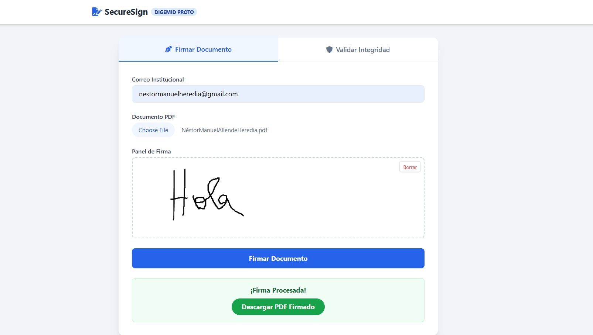
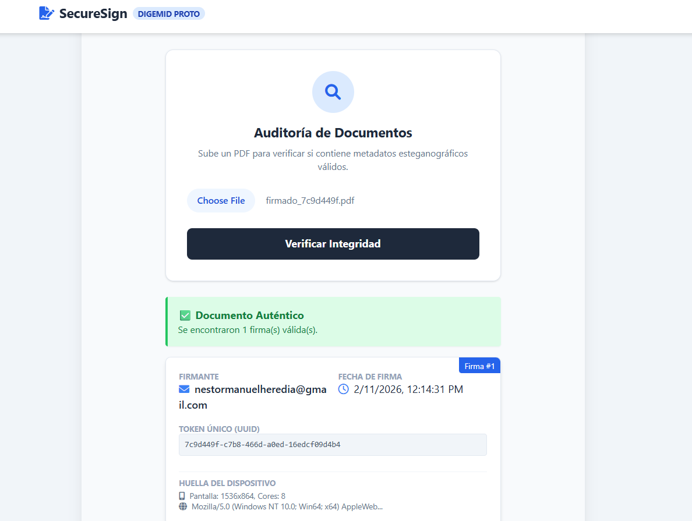

# SecureSign: Steganographic PDF Signature System 

**SecureSign** is a web-based digital signature platform that goes beyond visual stamping. It uses **LSB Steganography** to embed invisible metadata (device fingerprint, timestamp, user email, and a unique token) directly into the pixels of the signature and the PDF file structure.

This ensures **document traceability** and prevents tampering. If the signature image is modified or the file is corrupted, the validation system will detect the anomaly.

## 📸 Screenshots

### 1. Signing & PDF Processing
The interface allows users to upload a PDF, sign using a touch-enabled canvas, and automatically fuse the signature with the document.

### 2. Forensic Validation
Upload a signed PDF to audit its integrity. The system extracts the hidden JSON payload to reveal who signed it, when, and on what device.

---

## 🚀 Key Features

* **📄 PDF Manipulation:** Upload any PDF and stamp a signature on the last page without breaking the file structure (powered by `PyMuPDF`).
* **🕵️ Steganography (LSB):** Injects a hidden JSON payload into the Least Significant Bits of the signature's Red channel.
* **📱 Device Fingerprinting:** Captures device data (User Agent, Screen Resolution, CPU Cores, Touch capability) for security auditing.
* **🔐 Double-Factor Persistence:** Metadata is stored in **both** the signature pixels (PNG) and the PDF metadata headers, ensuring validation works even if image compression occurs.
* **✨ Modern UI:** Built with **Tailwind CSS** for a clean, responsive experience on mobile and desktop.

---

